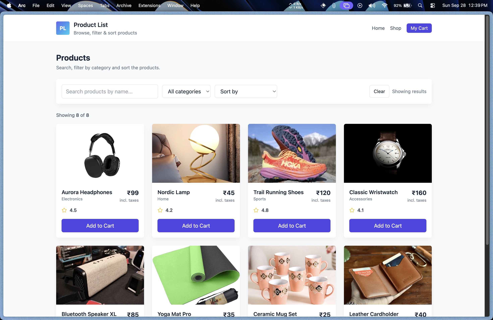
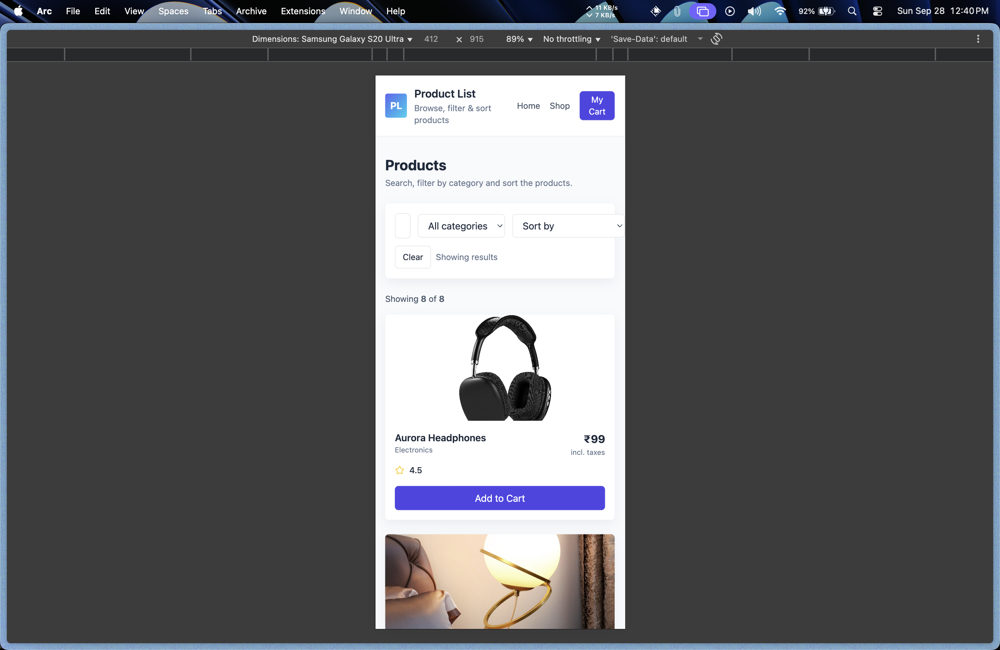
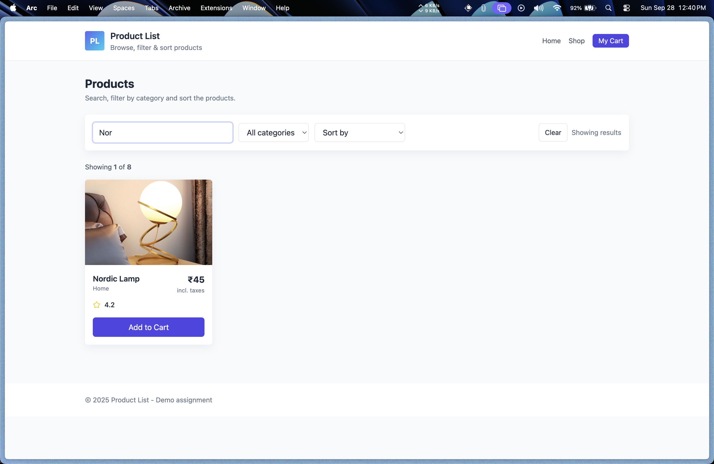
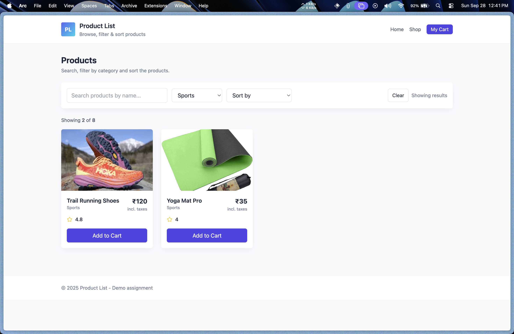
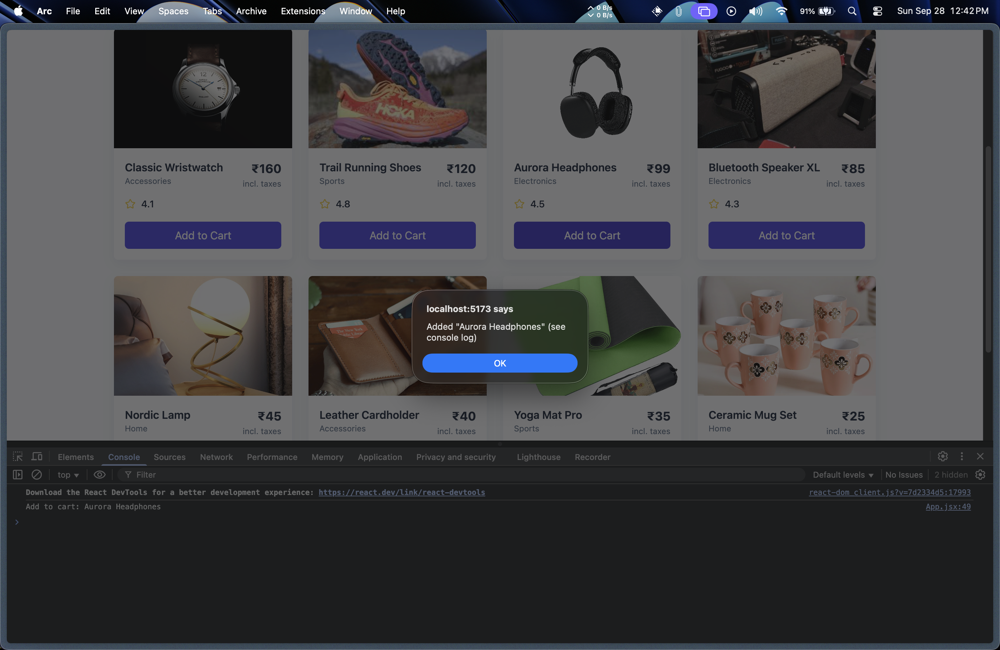

# 📦 Product List (React + Vite + Tailwind)

A simple product listing page built with **React** and **Tailwind CSS**.
Features include searching, filtering by category, sorting by price/rating, and adding products to the cart (console log).

---

## 🚀 Features

* 📋 **Product Grid** – Displays all products in a clean responsive grid layout.
* 🔍 **Search** – Filter products by name.
* 🏷️ **Category Filter** – Filter products by category using a dropdown.
* ↕️ **Sorting Options** – Sort products by:

  * Price (Low → High, High → Low)
  * Rating (High → Low, Low → High)
* 🛒 **Add to Cart** – Each product has an *Add to Cart* button which logs the product name to the console.
* 📱 **Responsive UI** – Works well on mobile and desktop.
* 🎨 **Tailwind Styling** – Simple, modern design with reusable components.

---

## 🖼️ Screenshots

1. **Homepage (Full View)**  
   Displays all products in a desktop layout.  
   

2. **Responsive View (Mobile/Tablet)**  
   Grid stacks correctly on smaller screen widths.  
   

3. **Search in Action**  
   Filtered results shown while typing in the search bar.  
   

4. **Category Filter Applied**  
   Products shown based on selected category.  
   

5. **Sorting by Price/Rating**  
   Products sorted by "Price: Low → High".  
   

6. **Add to Cart Button Click**  
   Browser console logging "Add to cart: Product Name".  
   


## 📂 Project Structure

```
Entri_Elevate_FSD_Assignment10/
├── public/
├── src/
│   ├── components/
│   │   ├── Navbar.jsx
│   │   ├── FilterBar.jsx
│   │   ├── ProductCard.jsx
│   │   └── ProductGrid.jsx
│   ├── data/
│   │   └── products.js
│   ├── App.jsx
│   ├── main.jsx
│   └── index.css
├── index.html
├── tailwind.config.cjs
├── postcss.config.cjs
├── package.json
└── README.md
```

---

## ⚙️ Installation & Running

1. Clone the repo:

```bash
git clone https://github.com/rovxn/Entri_Elevate_FSD_Assignment10.git
cd Entri_Elevate_FSD_Assignment10
```

2. Install dependencies:

```bash
npm install
```

3. Run development server:

```bash
npm run dev
```

4. Open the URL shown in terminal (e.g. `http://localhost:5173`).

---

## 📝 Notes

* Product data is defined in `src/data/products.js`.
* *Add to Cart* currently just logs the product name to the console for simplicity (as per assignment instructions).
* Styling is done entirely with **Tailwind CSS** for responsiveness.
